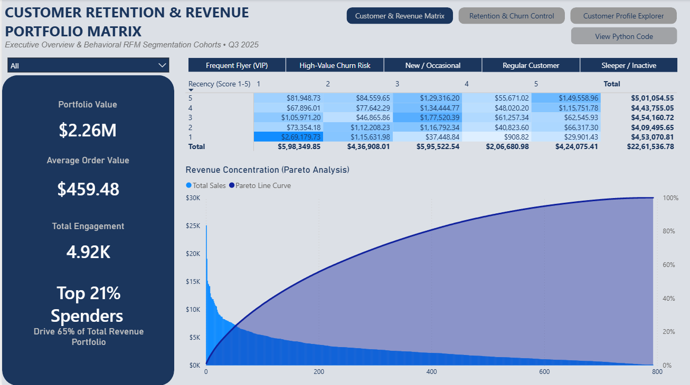
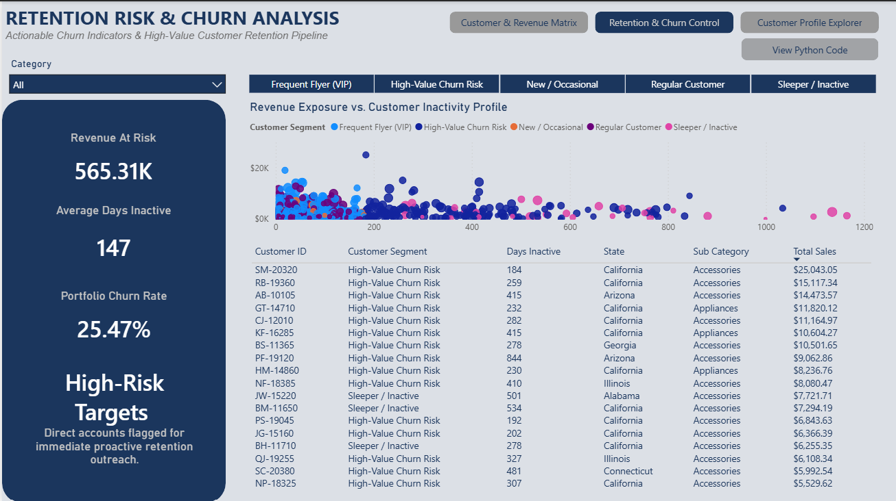
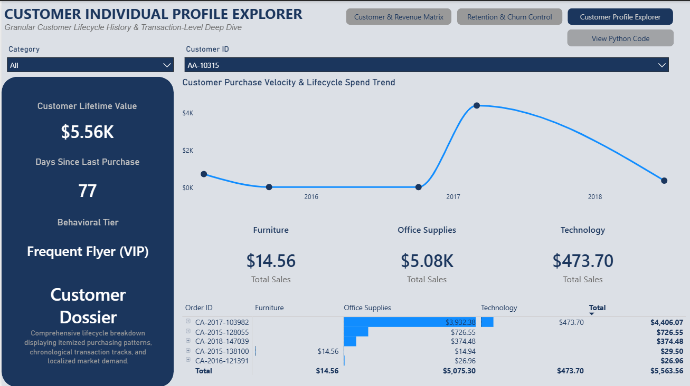

# Enterprise Customer Segmentation & Retention Studio — Python + Power BI

## 🎯 Executive Project Summary
An enterprise-grade customer behavioral analytics system engineered to track customer lifetime value (CLV), purchase velocity, and retention risk. By deploying a hybrid methodology combining raw statistical processing in **Python** with advanced **Power BI** relational modeling, this project transforms over 5,000 transaction logs into a highly actionable corporate retention studio.

* **The Core Strategic Insight:** A custom Pareto analysis revealed that the top **21% of high-value spenders drive roughly ~65% of the total corporate revenue portfolio**, proving extreme financial concentration and heavy reliance on premium cohorts.

---

## Business Intelligence Architecture & Core Interfaces
The interactive studio is engineered across 3 distinct, cohesive page layers designed with a strict corporate grid layout (Corporate Navy `#1B365D` on a Light Slate canvas):

### Page 1: Customer Portfolio Health Matrix
An executive-level strategic dashboard mapping macro revenue concentration and behavioral interactions.
* **Diagnostic Panel:** Features a dark vertical sidebar tracking portfolio metrics (`Total Revenue`, `Unique Orders`, `Average Order Value`) calculated using explicit, performance-optimized DAX measures.
* **Hero 5x5 Behavioral Heatmap:** A cross-tab matrix tracking `Recency` vs `Frequency` score tiers, utilizing background color gradients to spotlight exactly where corporate cash flow is clustered.
* **Pareto Distribution Curve:** A dual-axis Line and Column visual mapping individual customer revenue ranks against a cumulative percentage curve ending at 100% with zero layout scrollbars.

***

### Page 2: Churn Risk & Retention Command Centre
An operational command centre designed to isolate high-value underperforming accounts and track financial revenue exposure.
* **Exposure Hook Panel:** Evaluates total `Revenue at Risk` and `Portfolio Churn Rate` via specialized DAX conditional metrics.
* **Revenue Exposure Scatter Plot:** Clusters customers spatially across an executive grid (Days Inactive vs Total Sales) to instantly isolate high-value accounts sliding into the inactive zone.
* **Actionable Churn Hit-List:** A highly filtered operational ledger supplying account managers with the exact names, states, and primary product lines of leaking accounts for direct outreach, with columns condensed to eliminate data gaps.

***

### Page 3: Deep-Dive Customer Individual Explorer
A granular look-up dossier for individual client accounts allowing account management teams to audit line-item relationship histories before client outreach.
* **Dossier Search Engine:** Employs an interactive lookup index to text-search and isolate a single customer profile across 5,000+ files.
* **Purchase Velocity Timeline:** A smooth Bezier curved line visual illustrating individual lifecycle spending trends.
* **Product Category Spend Ribbon:** Modern, flat card badges displaying specific categorical capital allocation (Furniture, Technology, Office Supplies).
* **Collapsible Transaction Matrix Ledger:** An itemized, cross-tabular invoice grid splitting specific orders by category with active horizontal data bars to analyze line-item invoices dynamically without visual text gaps.

---

## Data Engineering Pipeline (Python Layer)
Instead of relying on basic relational database summaries, a custom analytical data engineering pipeline was built in Python (Pandas/NumPy) to group transactional data by customer ID:
* **Recency Metric:** Calculated the precise number of operational days since each customer's last distinct purchase occasion.
* **Frequency/Monetary Scoring:** Built statistical **RFM Quintile Models** using Pandas `qcut` data binning to assign relative 1-5 behavior rank tiers to every customer record.
* **Pareto Concentration:** Scripted a running cumulative sum percentage tracker to map out high-value revenue clusters.
* **Data Synthesis:** Merged the new multidimensional customer metrics back into the core granular transaction table via an optimized relational merge, exporting an enriched dataset for interactive slicing.

---

## How to Run the Project System
1. Clone this repository or download the folders.
2. Open the `data-engine/Customer_Segmentation_Model.ipynb` file inside Anaconda/Jupyter Notebook to review the statistical modeling engine.
3. Open `dashboards/Superstore_Customer_Segmentation_RFM.pbix` in Power BI Desktop to interact with the live interactive dashboard studio.
